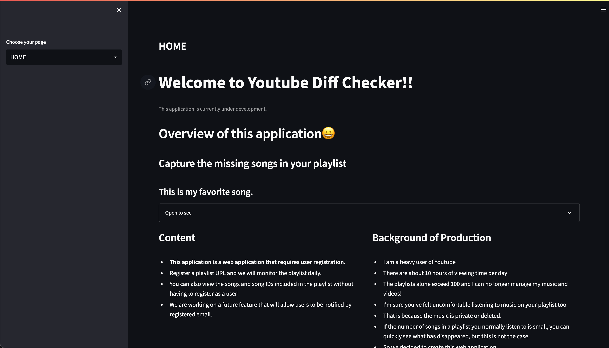
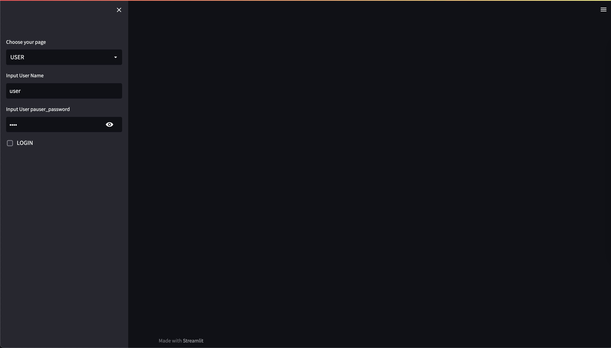
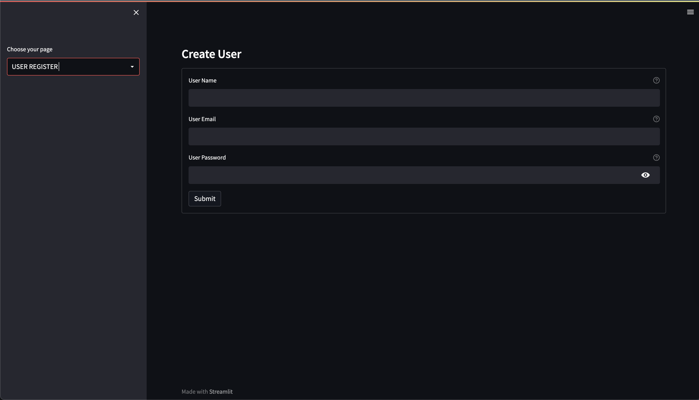
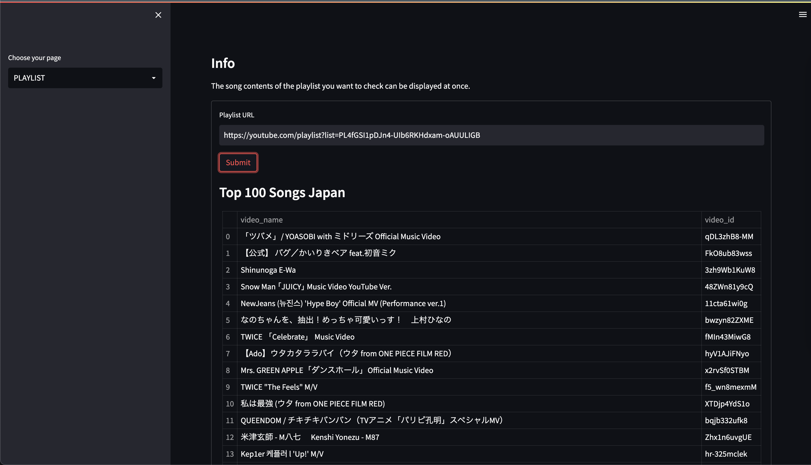
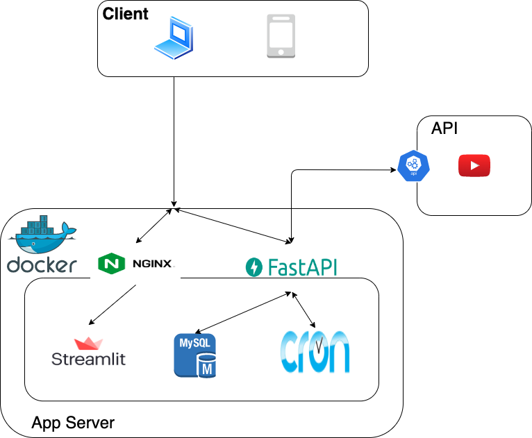

# Youtube Diff Checker

<!-- -->

<!--  -->

---

### Attention

* **⚠See the documentation folder `Document` for detailed specifications.⚠**
* **Currently under refactoring.....**

---

It is an application that displays the songs in the playlist registered in Youtube that have disappeared.
In principle, this is an application to be used by registered users
Some functions can be used without user registration

## URL

---

* http://www.youtube-diff-checker.com:8503/
  * SSL conversion to be done at a later date

---

<!-- ### Usage

| Img | Usage |
| :---: | :---: |
|  | home |
|   | User login |
|   | User register |
|   | Your Playlist Info | -->

### Usage Technology and Library

* Python 3.9
* FastAPI 0.85
* uvicorn
* SQLAlchemy 1.4
* Docker
* MySQL
* Streamlit
* Nginx
* YoutubeAPI
* VPS
* GithubActions

### System overview

### GithubActions

* The lint test is executed when you push to the main branch on Github.
* This is done when a pull request for the main branch has been approved.

### List of Functions

* User registration and login Functions
* Playlist registration Function
* Deleted video display Function
* Automatic Notification Function
* Automatic collection Function

#### Test

* Unit test
  * by pytest

---
